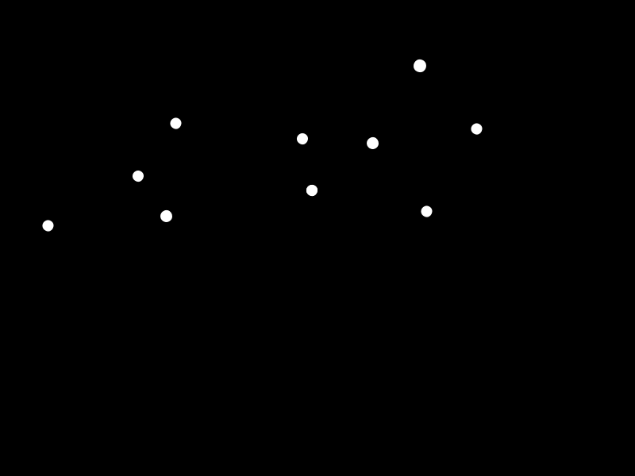
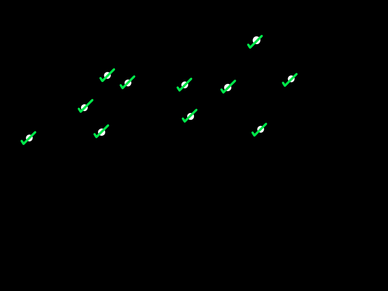
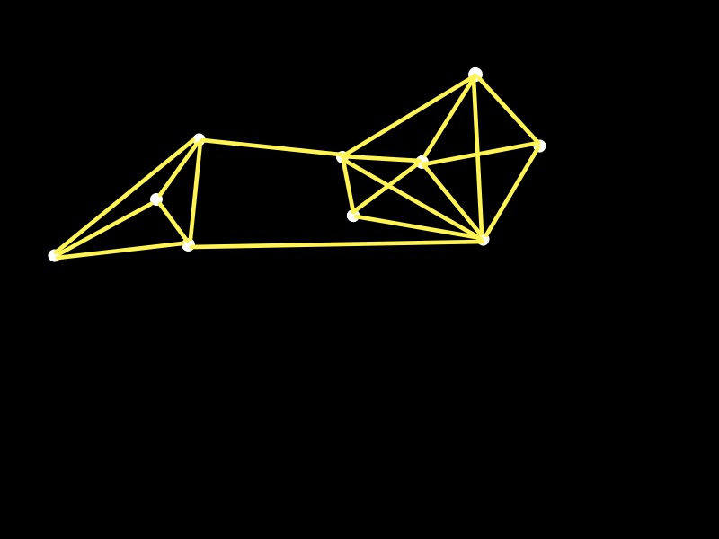
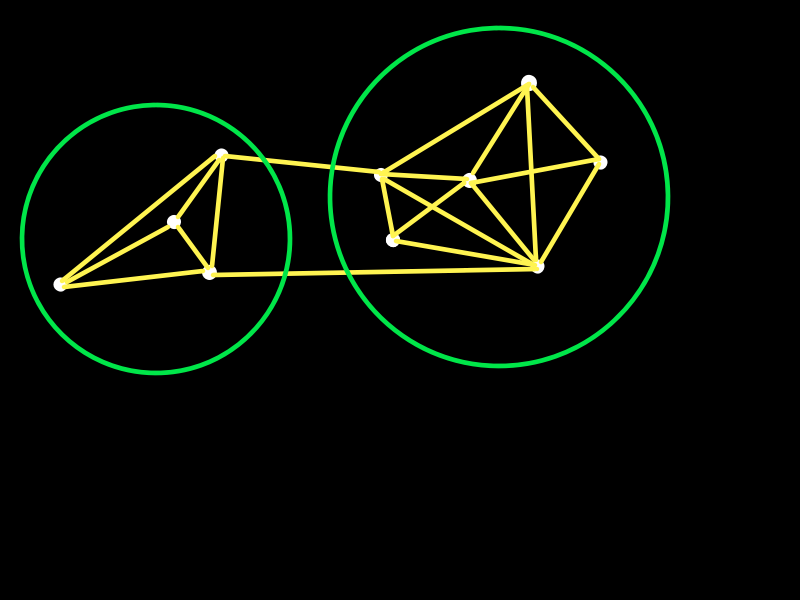
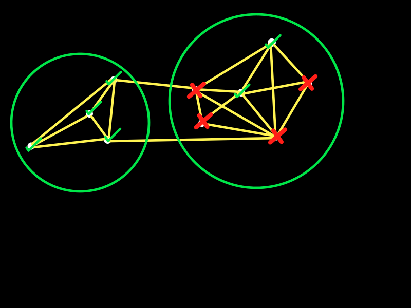

!SLIDE center

## >>> There will be a whiskey giveaway ##
##  at some point during this talk. <<< ##

!SLIDE center

### Now that I have your attention... ###

!SLIDE

# What do these people have in common? #

!SLIDE center

!SLIDE center

!SLIDE center

!SLIDE center

!SLIDE center

# They are all designers. #

!SLIDE center

## By which I do not mean "graphic designers" ##

!SLIDE center

## I mean they are engaged in the process of design ... ##

## The process of solving problems. ##

!SLIDE center

!SLIDE center

# 1 9 6 4 #

!SLIDE center

# "Design is a fit of form to context." #

!SLIDE center

# "Design is a fit of form to context." #

## form:  a solution to a problem ##

## context: the definition of the problem ##

!SLIDE center

## Therefore design is merely defining a problem, and then solving it.

!SLIDE center

## Alexander argues that finding fit can only be done by encountering the ways a proposed form _does not fit_ its context. ##

!SLIDE center

## So we think of the design context as a set of constraints. ##

## Some of these constraints we can identify.  Others are largely unknown. ##

!SLIDE center

!SLIDE center

## Alexander uses the example of designing a tea kettle. ##

<a href="http://www.flickr.com/photos/kirbrik28/3368088133/">via kirbrik28</a>

!SLIDE center

### In such a context the constraints might include safety and capacity constraints, cost constraints, size and durability constraints, maintenance constraints, aesthetic constraints, etc. ###

!SLIDE center

### Our goal as designers is to "fit" our form to these constraints -- to satisfy these constraints. ###

!SLIDE center

### Complicating matters is that constraints are interrelated. ###
### Fitting one constraint may cause a misfit with another. ###

!SLIDE center

### Fortunately, some sets of constraints are more tightly coupled than others. ###

!SLIDE center

### Meaning that we can use partial forms which fit a group of constraints well, mostly independent of other groups of constraints.

!SLIDE center

### These guys encountered a problem.  ###

[bb]

[ tv gone ]

[ go out across the country trying to score and watch television ]

