!SLIDE center 

## While travelling in India, I encountered a problem. ##

!SLIDE center

### How do I get one of those fly-ass Tamil Nadu 'staches? ###

!SLIDE center 

## OK.  And after a fashion intervention... ##

!SLIDE center 

## OK.  And after a fashion intervention, I encountered an actual business-related problem. ##

!SLIDE commandline incremental

    $ time rake vlad:deploy to=staging
    [ ... churn churn churn ... ]
    real	8m32.012s

    $ man how_long_until_my_shitty_cdma_connection_fails
    [ ... churn churn churn ... ]
    Between 6 and 7 minutes, on this train."

    $ asdfgjkagg90g4#%$@gskd    
    -bash: asdfgjkagg90g4#%gskd: command not found

!SLIDE center 

!SLIDE center 

# Christopher Alexander says this problem is a Design question. #

!SLIDE center 

# Which can be expressed as a series of constraints in a design context. #

!SLIDE center 

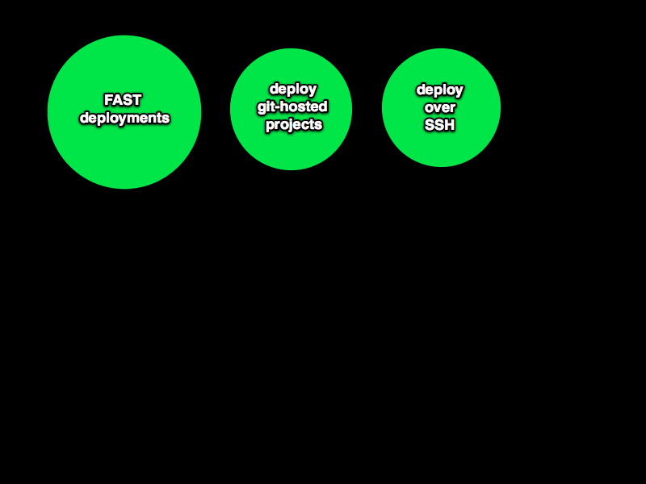

### Like this. ###

!SLIDE center 

### Implicit in the context are constraints about whether it's worth pursuing the problem at all. ###
###  If the design process has low enough overhead it might be worth pursuing. ###

!SLIDE center 

### If I try reading some vlad or capistrano code and doing a little spike on whether I can make a fast deployment *somehow*, is there really any downside to the experiment? ###

!SLIDE center 

!SLIDE center 

!SLIDE code sm

    @@@ ruby

    # clone configuration repo, if it doesn't exist already; don't fail if it exists
    remote_task :pull_config_repository, :roles => :app do
      run "echo 'cloning repo: #{config_repository}'; cd #{parent_path(deploy_config_to)} && git clone #{config_repository} project_config || /bin/true"
    end
    
    # make sure the repo checkout is up-to-date
    remote_task :refresh_deployment, :roles => :app do
      run "echo 'Updating checkout in [#{deploy_to}]...' && " +
        "cd #{deploy_to} && git fetch origin +refs/heads/#{branch}:refs/remotes/origin/#{branch} && git reset --hard origin/#{branch}"
    end
    
    # update configuration files, overlay onto repo checkout
    desc "refresh remote configuration files"
    remote_task :refresh_config_files, :roles => :app do
      run "echo 'refreshing configuration files to [#{deploy_to}] from [#{deploy_config_to}/#{environment_name}]...' && " +
        "cd #{deploy_config_to} && git fetch origin && git reset --hard origin/master && " +
        "rsync -avz --progress #{deploy_config_to}/#{project_name}/#{environment_name}/ #{deploy_to}/"
    end
    
    desc "run any post-setup tasks for this environment"
    task :post_setup do
      if Rake::Task.task_defined? "deploy:#{environment_name}:post_setup"
        puts "Running deploy:#{environment_name}:post_setup task..."
        Rake::Task["deploy:#{environment_name}:post_setup"].invoke
      else
        puts "No task deploy:#{environment_name}:post_setup defined.  Skipping."
      end
    end

!SLIDE code sm

    @@@ ruby
    
    def per_environment_file
      build_filename("deploy-#{initial_environment_name}")
    end
    
    def load_global_configuration
      YAML.load(File.read(configuration_file))
    rescue Exception => e
      raise "Cannot load configuration file [#{configuration_file}]: #{e.to_s}"
    end  
    
    def load_environment_configuration
      return {} unless File.exists?(per_environment_file)
      puts "Overriding global configuration with environment [#{initial_environment_name}] settings from [#{per_environment_file}]"
      YAML.load(File.read(per_environment_file)) if File.exists?(per_environment_file)
    rescue Exception => e
      raise "Cannot load per-environment configuration file [#{per_environment_file}]: #{e.to_s}"
    end  
    
    def loaded_configuration 
      @loaded_configuration ||= load_global_configuration.merge(load_environment_configuration)
    end

!SLIDE center

!SLIDE center 

!SLIDE center 

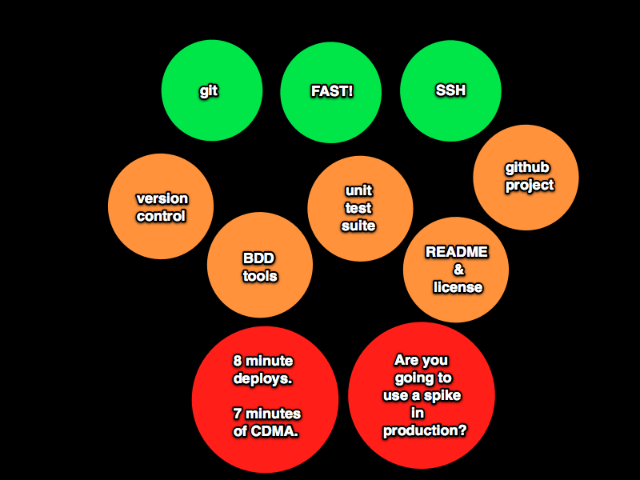

!SLIDE center 

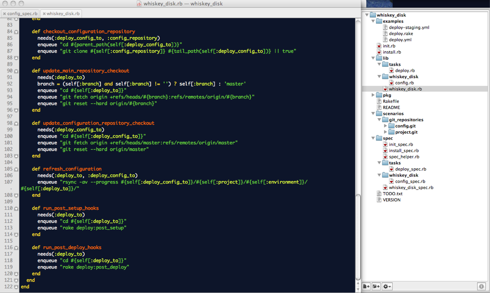

!SLIDE center 

!SLIDE center 

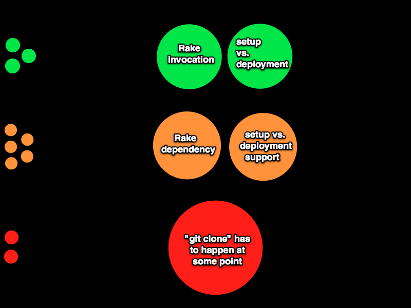

!SLIDE code sm

    @@@ ruby
    namespace :deploy do
      desc "Perform initial setup for deployment"
      task :setup do
        WhiskeyDisk.ensure_main_parent_path_is_present        if WhiskeyDisk.remote?
        WhiskeyDisk.ensure_config_parent_path_is_present     
        WhiskeyDisk.checkout_main_repository                  if WhiskeyDisk.remote?
        WhiskeyDisk.install_hooks                             if WhiskeyDisk.remote?
        WhiskeyDisk.checkout_configuration_repository
        WhiskeyDisk.update_main_repository_checkout           if WhiskeyDisk.remote?
        WhiskeyDisk.update_configuration_repository_checkout
        WhiskeyDisk.refresh_configuration
        WhiskeyDisk.run_post_setup_hooks
        WhiskeyDisk.flush
      end
      
      desc "Deploy now."
      task :now do
        WhiskeyDisk.update_main_repository_checkout           if WhiskeyDisk.remote?
        WhiskeyDisk.update_configuration_repository_checkout
        WhiskeyDisk.refresh_configuration
        WhiskeyDisk.run_post_deploy_hooks
        WhiskeyDisk.flush
      end
      
      task :post_setup do
        env = WhiskeyDisk[:environment]
        Rake::Task["deploy:#{env}:post_setup"].invoke if Rake::Task.task_defined? "deploy:#{env}:post_setup"      
      end
    
      task :post_deploy do
        env = WhiskeyDisk[:environment]
        Rake::Task["deploy:#{env}:post_deploy"].invoke if Rake::Task.task_defined? "deploy:#{env}:post_deploy"      
      end
    end

!SLIDE center 

!SLIDE center 

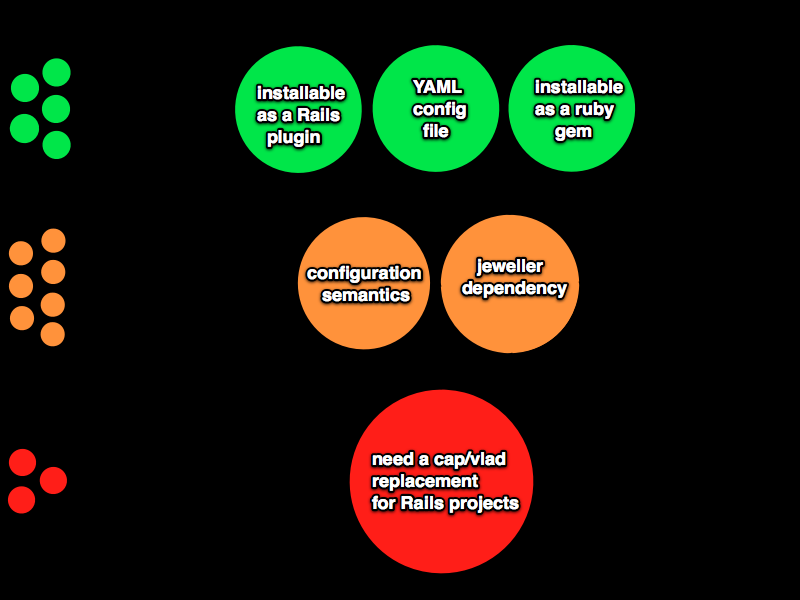

!SLIDE center

!SLIDE code smaller

    @@@ yml
    staging:
      domain: "user@www.example.com"
      deploy_to: "/var/www/suparsite.com/"
      repository: "git://github.com/clarkkent/suparsite.git"
      config_repository: "git@github.com:clarkkent/suparconfig.git"
      deploy_config_to: "/var/cache/git/suparconfig"
      branch: "production"
      rake_env:
        RAILS_ENV: "production"
    local:
      repository: "git://github.com/clarkkent/suparsite.git"
      config_repository: "git@github.com:clarkkent/suparconfig.git"
      deploy_to: "/Users/clark/git/suparsite"
      deploy_config_to: "/Users/clark/git/suparconfig"
      rake_env:
        RAILS_ENV: "production"

!SLIDE code sm

    @@@ ruby
    require 'rake'
    require 'rake/testtask'
    
    desc 'Default: run unit tests.'
    task :default => :test
    
    desc 'Test RubyCloud'
    Rake::TestTask.new(:test) do |t|
      t.libs << 'lib'
      t.pattern = 'spec/**/*_spec.rb'
      t.verbose = true
    end
    
    begin
      require 'jeweler'
      Jeweler::Tasks.new do |gemspec|
        gemspec.name = "whiskey_disk"
        gemspec.summary = "embarrassingly fast deployments."
        gemspec.description = "Opinionated gem for doing fast git-based server deployments."
        gemspec.email = "rick@rickbradley.com"
        gemspec.homepage = "http://github.com/flogic/whiskey_disk"
        gemspec.authors = ["Rick Bradley"]
        gemspec.add_dependency('rake')
      end
      Jeweler::GemcutterTasks.new  
    rescue LoadError
      puts "Jeweler not available. Install it with: sudo gem install jeweler -s http://gemcutter.org"
    end

!SLIDE center 

!SLIDE center 

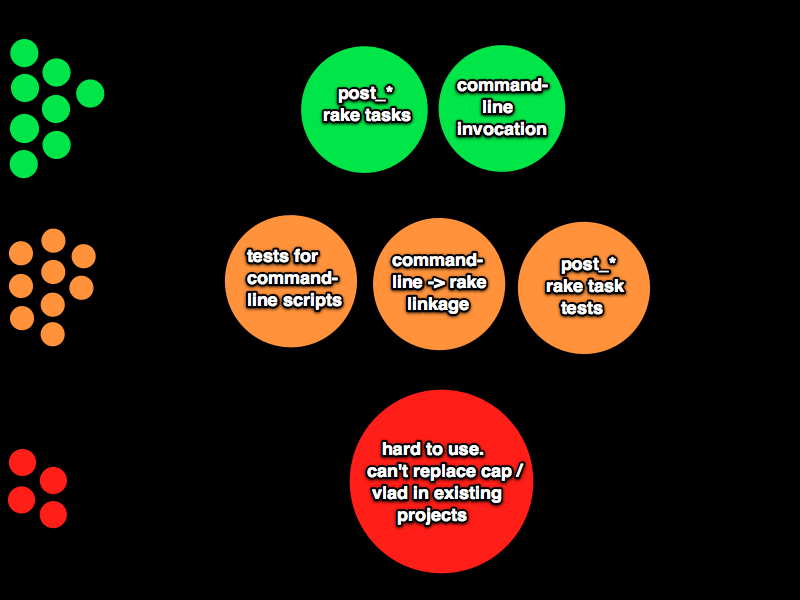

!SLIDE code sm

    @@@ ruby
    def run_command
      eval File.read(File.join(File.dirname(__FILE__), *%w[.. bin wd]))
    end
    
    describe 'wd command' do
      before do
        ENV['to'] = ENV['path'] = nil
      end
    
      describe 'when no command-line arguments are specified' do
        before do
          Object.send(:remove_const, :ARGV)
          ARGV = []
        end  
    
        it 'should not run rake tasks' do
          Rake::Application.should.receive(:new).never
          lambda { run_command }
        end
    
        it 'should fail' do
          lambda { run_command }.should.raise
        end
      end
    
      describe "when the 'setup' command is specified" do
        before do
          Object.send(:remove_const, :ARGV)
          ARGV = ['setup']
        end  
    
        describe 'and no target is specified' do    
          it 'should not run rake tasks' do
            Rake::Application.should.receive(:new).never
            lambda { run_command }
          end
    
    # ... and so on

!SLIDE code sm

    @@@ ruby
    #!/usr/bin/env ruby 

    require 'optparse'
    require 'whiskey_disk/rake'

    $0 = "#{$0} setup|deploy"  # jesus, this is a hack.

    options = {}
    op = OptionParser.new do |opts|
      opts.on('-t=TARGET', '--to=TARGET', "deployment target") do |target| 
        options[:target] = target
      end

      opts.on('-p=TARGET', '--path=TARGET', "configuration path") do |path|
        options[:path] = path
      end

      opts.on_tail('-h', '--help', 'show this message') do
        raise opts.to_s
      end
    end

    rest = op.parse(ARGV)
    raise op.to_s unless options[:target]
    raise op.to_s unless rest and rest.size == 1
    command = rest.first
    raise op.to_s unless ['deploy', 'setup'].include?(command)

    ENV['to'] = options[:target]
    ENV['path'] = options[:path]

    if command == 'deploy'
      Rake::Task['deploy:now'].invoke
    else
      Rake::Task['deploy:setup'].invoke
    end

!SLIDE center 

!SLIDE center

!SLIDE center 

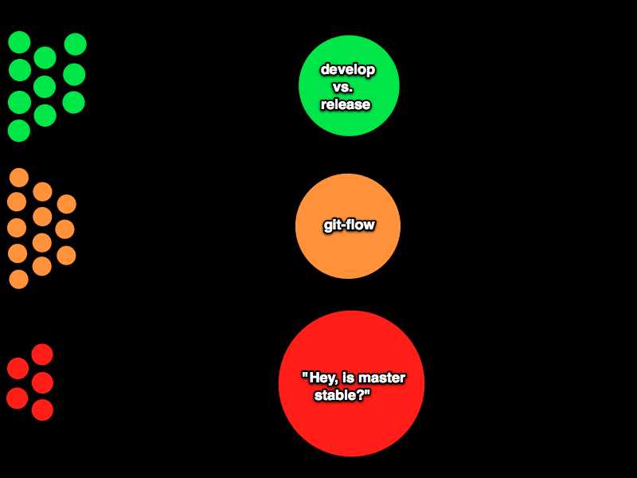

!SLIDE center

# So, wait.  What kind of constraint is this? #

!SLIDE center

!SLIDE center 

## Alexander started in the 1960's trying to understand why modern building architecture is producing buildings which are lifeless, hard to maintain, and ill-suited to their environments. ##

!SLIDE center 

<a href="http://www.flickr.com/photos/bohemianrabbit/2766928962/">via bohemianrabbit</a>

!SLIDE center 

<a href="http://www.flickr.com/photos/burtoholmes/337429617/">via burtoholmes</a>

!SLIDE center

## While "traditional" architecture is often easily maintained, full of life, and a good fit for its context. ##

!SLIDE center

<a href="http://stevenlevourch.smugmug.com/Travelling-throughout-the/Cameroon/IMG4591v2-copy/140156425_mJ9Uw-L.jpg">via stevenlevourch</a>

!SLIDE center

<a href="http://www.flickr.com/photos/studiogerk/2382784143/">via studiogerk</a>

!SLIDE center 

### He dubs design techniques which have developed naturally and traditionally, as "un-selfconscious" techniques. ###

### These techniques provide good local solutions for the design problems their cultures encounter.  ###

!SLIDE center

### He distinguishes them from design techniques, formulated as rules, disconnected from local and cultural development, as "selfconscious" techniques.

!SLIDE center

### Modern architecture and modern design as a whole are firmly rooted in selfconscious design techniques. ###

!SLIDE center

### Software design is even more firmly rooted in the selfconscious techniques, since there is no local or cultural tradition that we could have ever relied on. ###

!SLIDE center

<a href="http://www.flickr.com/photos/brewbooks/258025427/">via brewbooks</a>

### Much of Alexander's later work (pattern languages, the nature of order) addresses approaching unselfconscious techniques in a selfconscious society. ###

!SLIDE center 

# Can we find techniques in software that point us in that direction? #

!SLIDE center 

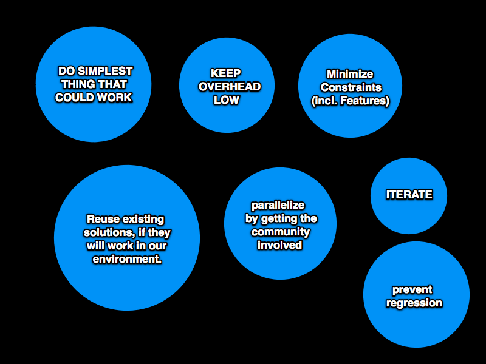

!SLIDE center

!SLIDE center 

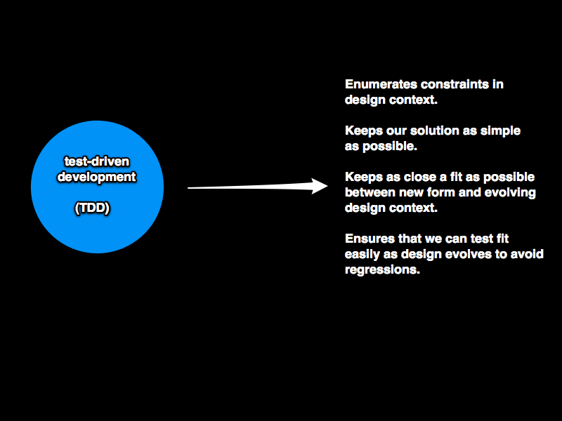

!SLIDE center 

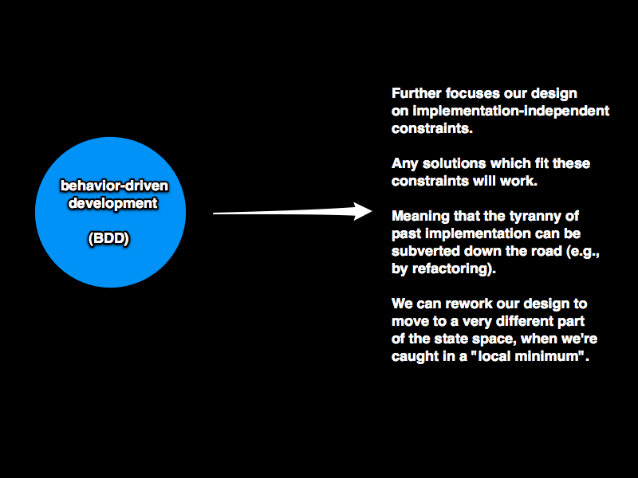

!SLIDE center 

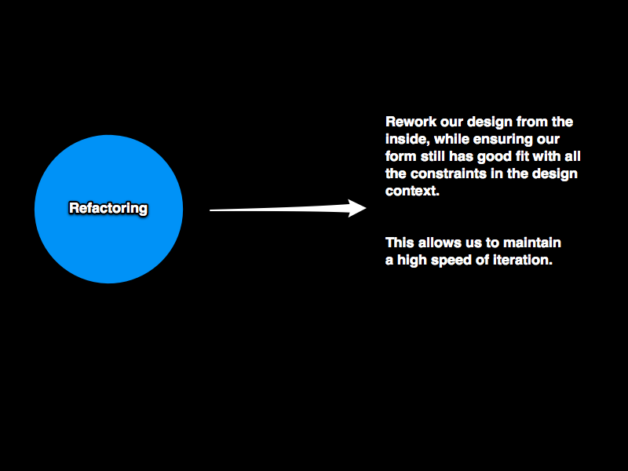

!SLIDE center 

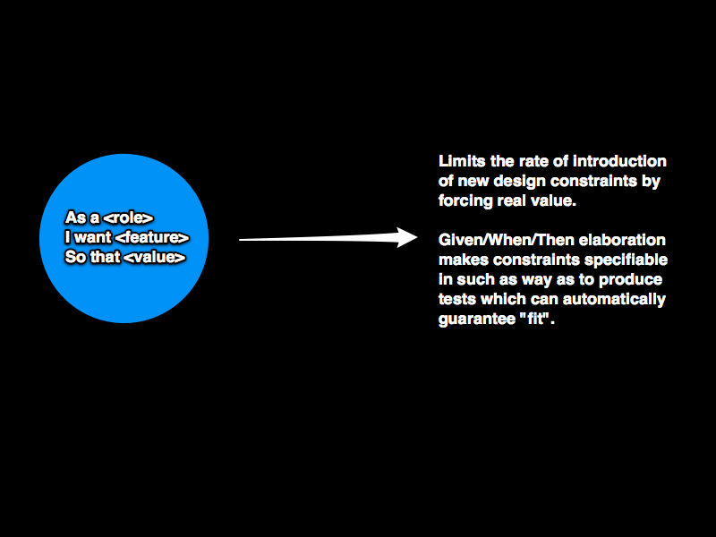

!SLIDE center

### The ceramics teacher announced on opening day that he was dividing the class into two groups.  All those on the left side of the studio, he said, would be graded solely on the *quantity* of work they produce, all those on the right solely on its *quality*. ###

### His procedure was simple:  on the final day of class he would bring in his bathroom scales and weigh the work of the "quantity" group:  fifty pounds of pots rated an "A", forty pounds a "B", and so on. ###

### Those being graded on "quality", however, needed to produce only one pot -- albeit a perfect one -- to get an "A". ###

### Well, came grading time and a curious fact emerged:  the works of highest quality were all produced by the group being graded for quantity. ###

-- From <a href="http://tinyurl.com/artandfear">"Art & Fear" (c) 1993, Bayles & Orland</a>

!SLIDE center

## Iteration is of utmost importance at all levels. ##

### From the lowest code-kata level, to the highest 30,000ft. design level. ###

!SLIDE center 

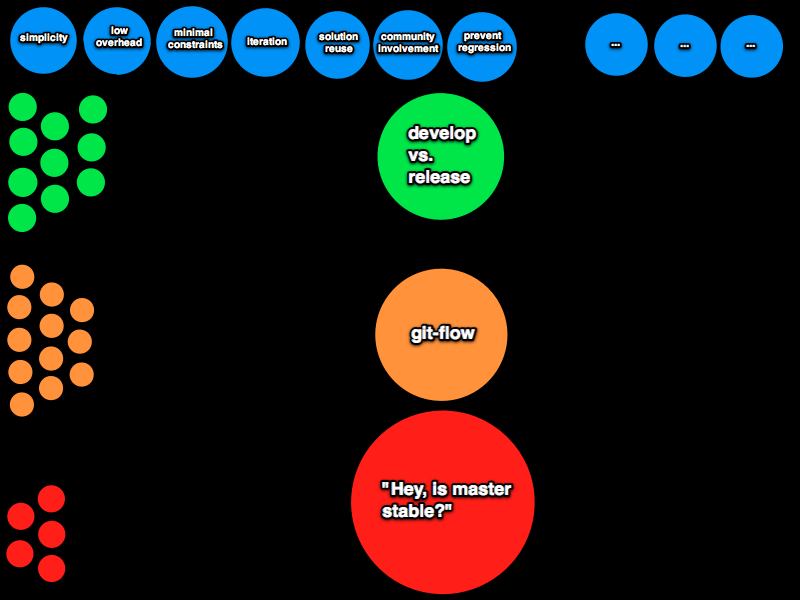

!SLIDE center

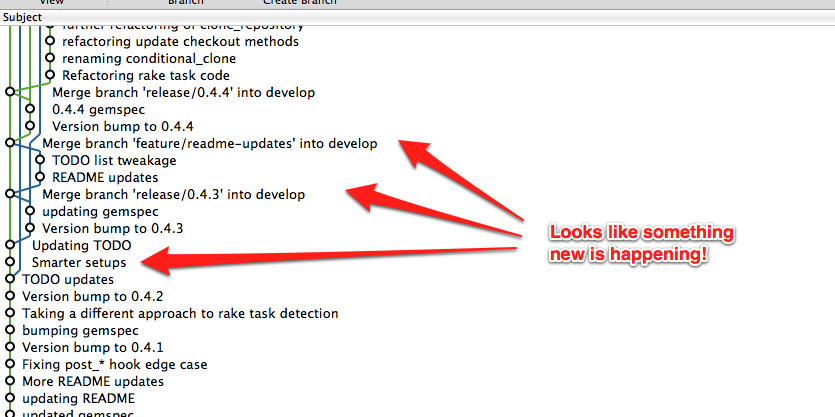

!SLIDE center 

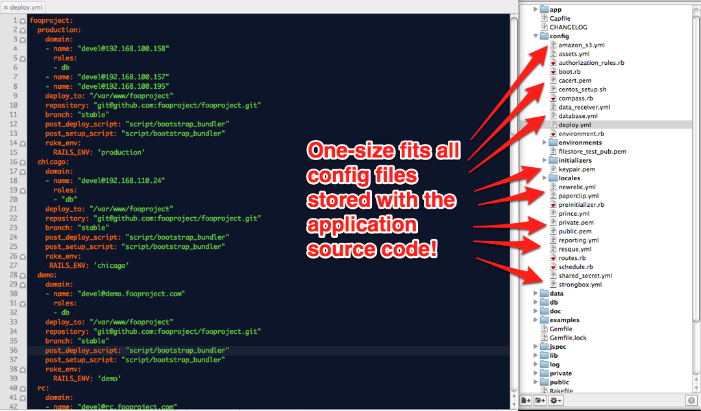

!SLIDE center 

!SLIDE code smaller

    @@@ yml
    foo:
      production:
        domain: "prod.foocorp.com"
        deploy_to: "/var/www/foo"
        repository: "git@github.com:foo/foo.git"
        branch: "stable"
        deploy_config_to: "/var/www/foo-config"
        config_repository: "git@github.com:foo/production-wd-config.git"
        config_branch: "master"
        rake_env:
          RAILS_ENV: 'production'
      demo:
        domain: "demo.foocorp.com"
        deploy_to: "/var/www/foo"
        repository: "git@github.com:foo/foo.git"
        branch: "stable"
        deploy_config_to: "/var/www/foo-config"
        config_repository: "git@github.com:foo/wd-config.git"
        config_branch: "master"
        config_target: "staging"
        rake_env:
          RAILS_ENV: 'demo'

!SLIDE center

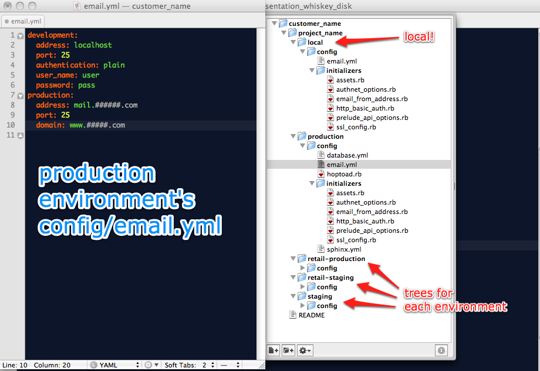

!SLIDE center 

!SLIDE center 

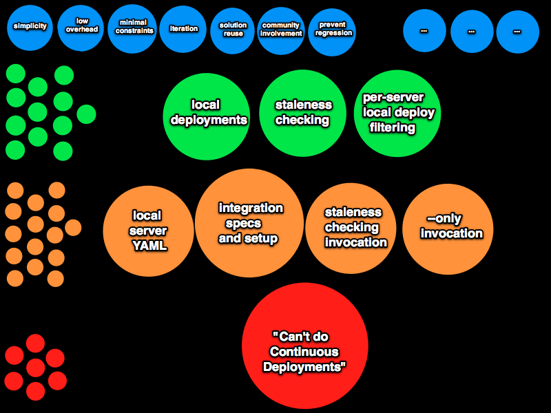

!SLIDE center

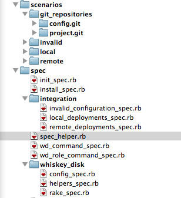

### Run git-daemon locally on two bare git repositories (project + config). ###
### Track the bare git repos inside the main wd project repo. ###
### Really run wd, which ssh's to a testing user on a localhost alias. ###

!SLIDE code sm 

    @@@ ruby
    integration_spec do  
      describe 'when configured for a local deployment' do
        before do
          setup_deployment_area
        end
        
        describe 'when the configuration specifies no domain' do
          before do
            @config = scenario_config('local/deploy.yml')
            @args = "--path=#{@config} --to=project:local-default"
          end
    
          describe 'performing a setup' do
            it 'should perform a checkout of the repository to the target path' do
              run_setup(@args)
              File.exists?(deployed_file('project/README')).should == true
            end
                
            it 'should report the local setup as successful' do
              run_setup(@args)
              File.read(integration_log).should =~ /local => succeeded/
            end
    
            it 'should exit with a true status' do
              run_setup(@args).should == true
            end
          end
    # ... and so on

!SLIDE code sm

    @@@ ruby
    # local target directory, integration spec workspace
    def deployment_root
      '/tmp/wd-integration-target/destination/'
    end
    
    # allow defining an integration spec block
    def integration_spec(&block)
      yield if ENV['INTEGRATION'] and ENV['INTEGRATION'] != ''
    end
    
    # reset the deployment directory for integration specs
    def setup_deployment_area
      FileUtils.rm_rf(deployment_root)
      File.umask(0)
      Dir.mkdir(deployment_root, 0777)
      Dir.mkdir(deployed_file('log'), 0777)
    end
    
    # run a wd setup using the provided arguments string
    def run_setup(arguments)
      wd_path  = File.join(File.dirname(__FILE__), '..', 'bin', 'wd')
      lib_path = File.join(File.dirname(__FILE__), '..', 'lib')
      system("/usr/bin/env ruby -I #{lib_path} -r whiskey_disk -rubygems #{wd_path} setup \
        #{arguments} > #{integration_log} 2> #{integration_log}")
    end
    
    def integration_log
      deployed_file('log/out.txt')
    end
    
    # ... etc.

!SLIDE center 

!SLIDE center 

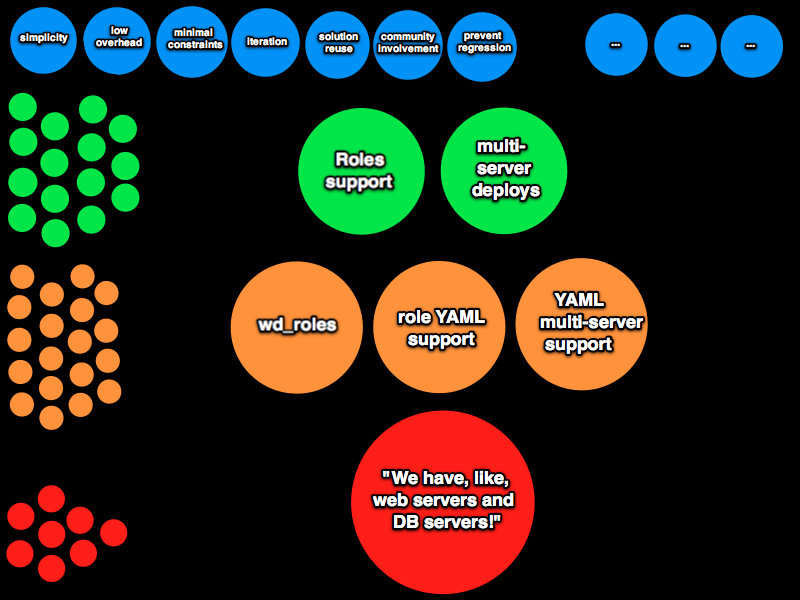

!SLIDE code smaller

    @@@ yml
    production:
      domain:
      - name: "tommy@app1.foocorp.com"
      - roles:
        - "app"
        - "www"
      - name: "tommy@jesusbox.foocorp.com"
        roles: 
        - "db"

!SLIDE code sm

    @@@ ruby
    namespace :deploy do
      task :create_rails_directories do
        if role? :www
          puts "creating log/ and tmp/ directories"
          Dir.chdir(RAILS_ROOT)
          system("mkdir -p log tmp")
        end
      end        
    
      task :db_migrate_if_necessary do
        Rake::Task['db:migrate'] if role? :db
      end
    
      # whytf is this even necessary?  Come on.  This should be built into ts:restart.
      task :thinking_sphinx_restart => [:environment] do
        if role? :app
          Rake::Task['ts:stop'].invoke rescue nil
          Rake::Task['ts:index'].invoke
          Rake::Task['ts:start'].invoke
        end
      end
    
      task :bounce_passenger do
        if role? :www
          puts "restarting Passenger web server"
          Dir.chdir(RAILS_ROOT)
          system("touch tmp/restart.txt")    
        end
      end
    
      # etc...
    
      task :post_setup  => [ :create_rails_directories ]
      task :post_deploy => [ :db_migrate_if_necessary, :thinking_sphinx_restart, :bounce_passenger ]
    end

!SLIDE center 

!SLIDE center 

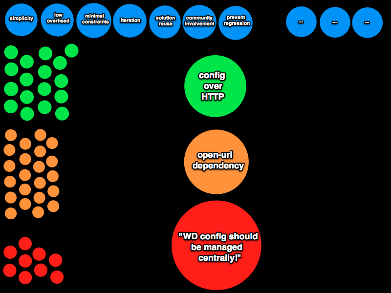

!SLIDE code smaller 

    @@@ diff
    --- a/lib/whiskey_disk/config.rb
    +++ b/lib/whiskey_disk/config.rb
    @@ -1,4 +1,6 @@
     require 'yaml'
    +require 'uri'
    +require 'open-uri'

		# ... heh. :-)
     
    
!SLIDE center 

!SLIDE center 

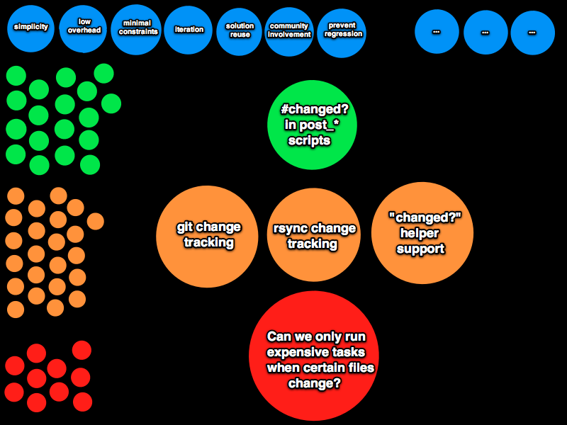

!SLIDE code sm

    @@@ ruby
    require 'whiskey_disk/helpers'
    
    namespace :deploy do
    
      task :run_migrations do
        if role?(:db) and changed?('db/migrate')
          puts "Running database migrations..."
          Rake::Task['db:migrate'].invoke
        end
      end
    
      task :compress_assets do
        if changed?('public/stylesheets') or changed?('public/javascripts') 
          puts "Getting my asset munge on..."
          # do some expensive asset compression stuff
        end
      end
    
      task :post_deploy => [ :run_migrations, :compress_assets ]
    end

!SLIDE commandline incremental

    $ git diff ad71bc6..d5163e9 | wc -l
    
    1029

!SLIDE center 

## With increased users come revelations ##
## about new problems. ##

!SLIDE center 

!SLIDE center 

## These imply knowledge of more possible constraints in the design context. ##
## Improving the fit of our form will introduce more overhead. ##

!SLIDE center 

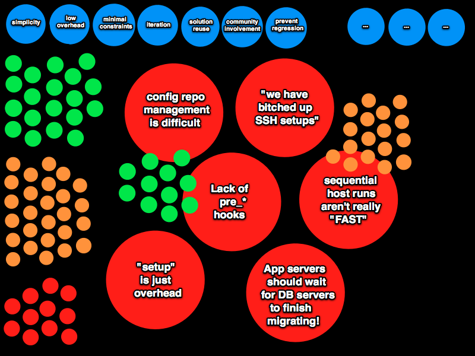

!SLIDE code tiny
    
    @@@ ruby
    class WhiskeyDisk
      class Config
        class << self
          def environment_name
            return false unless (ENV['to'] && ENV['to'] != '')
            return ENV['to'] unless ENV['to'] =~ /:/
            ENV['to'].split(/:/)[1]
          end
    
          def specified_project_name
            return false unless (ENV['to'] && ENV['to'] =~ /:/)
            ENV['to'].split(/:/).first
          end
    
          def override_project_name!(data)
            return if ENV['to'] && ENV['to'] =~ /:/
            ENV['to'] = data[environment_name]['project'] + ':' + ENV['to'] if data[environment_name]['project']
          end
    
          def path
            (ENV['path'] && ENV['path'] != '') ? ENV['path'] : false
          end
    
          def check_staleness?
            !!(ENV['check'] && ENV['check'] =~ /^(?:t(?:rue)?|y(?:es)?|1)$/)
          end
    
          def debug?
            !!(ENV['debug'] && ENV['debug'] =~ /^(?:t(?:rue)?|y(?:es)?|1)$/)
          end
          
          def domain_limit
            return false unless ENV['only'] and ENV['only'] != ''
            ENV['only']
          end
    
          def contains_rakefile?(path)
            File.exists?(File.expand_path(File.join(path, 'Rakefile')))
          end
    
          def find_rakefile_from_current_path
            original_path = Dir.pwd
            while (!contains_rakefile?(Dir.pwd))
              return File.join(original_path, 'config') if Dir.pwd == '/'
              Dir.chdir('..')
            end
            File.join(Dir.pwd, 'config')
          ensure
            Dir.chdir(original_path)
          end
    
          def base_path
            return path if path
            find_rakefile_from_current_path
          end
    
          def valid_path?(path)
            if path
              uri = URI.parse(path)
              return path if uri.scheme
              return path if File.file?(path)
            end
            
            false
          end

!SLIDE code tiny

    @@@ ruby
          def configuration_file
            return path if valid_path?(path)
            
            files = []
    
            files += [
              File.join(base_path, 'deploy', specified_project_name, "#{environment_name}.yml"),  # /deploy/foo/staging.yml
              File.join(base_path, 'deploy', "#{specified_project_name}.yml") # /deploy/foo.yml
            ] if specified_project_name
    
            files += [
              File.join(base_path, 'deploy', "#{environment_name}.yml"),  # /deploy/staging.yml
              File.join(base_path, "#{environment_name}.yml"), # /staging.yml
              File.join(base_path, 'deploy.yml') # /deploy.yml
            ]
    
            files.each { |file|  return file if File.exists?(file) }
    
            raise "Could not locate configuration file in path [#{base_path}]"
          end
    
          def configuration_data
            open(configuration_file) {|f| f.read }
          end
    
          def project_name
            specified_project_name || 'unnamed_project'
          end
    
          def repository_depth(data, depth = 0)
            raise 'no repository found' unless data.respond_to?(:has_key?)
            return depth if data.has_key?('repository')
            repository_depth(data.values.first, depth + 1)
          end
    
          # is this data hash a bottom-level data hash without an environment name?
          def needs_environment_scoping?(data)
            repository_depth(data) == 0
          end
    
          # is this data hash an environment data hash without a project name?
          def needs_project_scoping?(data)
            repository_depth(data) == 1
          end
    
          def add_environment_scoping(data)
            return data unless needs_environment_scoping?(data)
            { environment_name => data }
          end
    
          def add_project_scoping(data)
            return data unless needs_project_scoping?(data)
            override_project_name!(data)
            { project_name => data }
          end
    
          def localize_domain_list(list)
            [ list ].flatten.collect { |d| (d.nil? or d == '') ? 'local' : d }
          end
          
          def compact_list(list)
            [ list ].flatten.delete_if { |d| d.nil? or d == '' }
          end
          
          def normalize_domain(data)
            compacted = localize_domain_list(data)
            compacted = [ 'local' ] if compacted.empty?
            
            compacted.collect do |d|
              if d.respond_to?(:keys)
                row = { :name => (d['name'] || d[:name]) }
                roles = compact_list(d['roles'] || d[:roles])
                row[:roles] = roles unless roles.empty?
                row
              else
                { :name => d }
              end
            end
          end

!SLIDE code tiny

    @@@ ruby          
          def check_duplicates(project, target, domain_list)
            seen = {}
            domain_list.each do |domain|
              raise "duplicate domain [#{domain[:name]}] in configuration file for project [#{project}], target [#{target}]" if seen[domain[:name]]
              seen[domain[:name]] = true
            end
          end
          
          def normalize_domains(data)
            data.each_pair do |project, project_data|
              project_data.each_pair do |target, target_data|
                target_data['domain'] = check_duplicates(project, target, normalize_domain(target_data['domain']))
              end
            end
          end
    
          def normalize_data(data)
            normalize_domains(add_project_scoping(add_environment_scoping(data.clone)))
          end
    
          def load_data
            normalize_data(YAML.load(configuration_data))
          rescue Exception => e
            raise %Q{Error reading configuration file [#{configuration_file}]: "#{e}"}
          end
    
          def filter_data(data)
            current = data[project_name][environment_name] rescue nil
            raise "No configuration file defined data for project `#{project_name}`, environment `#{environment_name}`" unless current
    
            current.merge!({
              'environment' => environment_name,
              'project' => project_name,
            })
            
            current['config_target'] ||= environment_name
            current
          end
    
          def fetch
            raise "Cannot determine current environment -- try rake ... to=staging, for example." unless environment_name
            filter_data(load_data)
          end
        end
      end
    end

!SLIDE center

# At this time we would like to take a moment to recommend @coderetreat. #

!SLIDE code sm

    @@@ ruby
    require 'whiskey_disk/config/environment'
    require 'whiskey_disk/config/reader'
    
    class WhiskeyDisk
      class Config
        def fetch
          @fetch ||= reader.fetch
        end
        
        def reader
          @reader ||= Reader.new(env)
        end
        
        def env
          @env ||= Environment.new
        end
        
        def debug?
          fetch['debug']
        end
        
        def domain_limit
          fetch['domain_limit']
        end
        
        def check_staleness?
          fetch['staleness_checking']
        end
    
        def environment_name
          fetch['environment']
        end
    
        def project_name
          fetch['project']
        end
      end
    end

!SLIDE code sm

    @@@ ruby
    
    class WhiskeyDisk
      class Config
        class Reader
          attr_reader :env
          
          def initialize(environment)
            @env = environment
          end
          
          def fetch
            filter_data(load_data)
          end
          
          def filter_data(data)
            filter.filter_data(data)
          end
    
          def filter
            @filter ||= WhiskeyDisk::Config::Filter.new(self)
          end
    
          def load_data
            YAML.load(configuration_data)
          rescue Exception => e
            raise %Q{Error reading configuration file [#{configuration_file}]: "#{e.to_s}"}
          end
    
          def configuration_data
            open(configuration_file) {|f| f.read }
          end
    
          def configuration_file
            @location ||= locator.location
          end
    
          def locator
            @locator ||= Locator.new(env)
          end
        end
      end
    end

!SLIDE code sm

    @@@ ruby
    
    require 'whiskey_disk/config/abstract_filter'
    
    class WhiskeyDisk
      class Config
        class ConvertRoleStringsToListFilter < AbstractFilter
          def convert_roles_for_domain(domain)
            return domain unless domain['roles']
            domain.merge('roles' => [ domain['roles'] ].flatten)
          end
          
          def convert_all_roles(domains_list)
            domains_list.collect {|domain| convert_roles_for_domain(domain) }
          end
          
          def filter(data)
            data.merge('domain' => convert_all_roles(data['domain']))
          end
        end
      end
    end

!SLIDE center

!SLIDE center 

## We may decide that some constraints carry unacceptable overhead. ##

!SLIDE center 

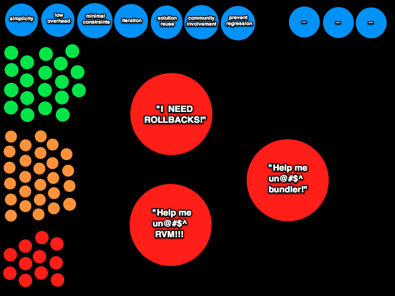

!SLIDE center 

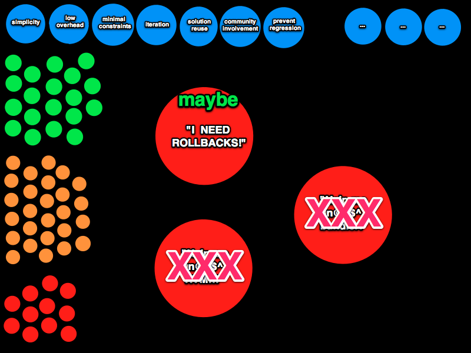

!SLIDE center

## Lines of code ##

#### Thanks to Apple™ Numbers™ for the easy-to-mangle color selections. ####

!SLIDE code small

# how fast is this? (twss?)

### [ by completely arbitrary metric of the original slow deployment ]

	before:  8+ minutes
	after:   15-45 seconds(*)

(*) from India, with the bulk of time allocated to reindexing sphinx indexes

	typically: 8-15 seconds for a normal deployment
