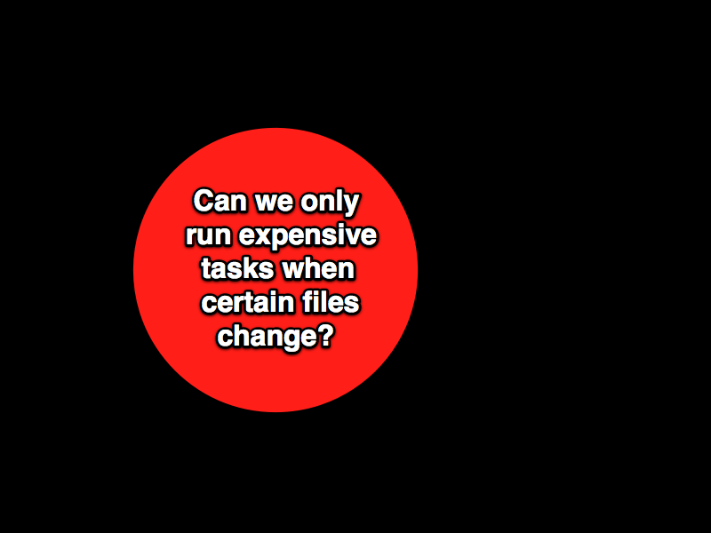

!SLIDE center 

# We start with a simple problem #

!SLIDE center 

!SLIDE center 

# OK.  And after dinner, maybe we have an actual business-related problem. #

!SLIDE commandline incremental

    $ time rake vlad:deploy to=staging
    [ ... churn churn churn ... ]
    real	8m32.012s

    $ man how_long_until_my_shitty_cdma_connection_fails
    [ ... churn churn churn ... ]
    Between 6 and 7 minutes, on this train."

    $ asdfgjkagg90g4#%$@gskd    
    -bash: asdfgjkagg90g4#%gskd: command not found

!SLIDE center 

!SLIDE center 

# Which can be expressed as a series of constraints in our design context #

!SLIDE center 

!SLIDE center 

## And if I just try reading some vlad/cap code and doing a little spike on it ... ##

!SLIDE center 

!SLIDE center 

!SLIDE center 

# spike code #

!SLIDE center 

!SLIDE center 

!SLIDE center 

# initial BDD'd code #

!SLIDE center 

!SLIDE center 

!SLIDE center 

# Rake setup code #

!SLIDE center 

!SLIDE center 

!SLIDE center 

# config example code #

!SLIDE center 

!SLIDE center 

!SLIDE center 

# command-line examples, code, tests #

!SLIDE center 

!SLIDE center 

!SLIDE center 

# start big discussion about alexander's unselfconscious techniques #

!SLIDE center 

!SLIDE center 

# more big discussion about alexander's unselfconscious techniques #

!SLIDE center 

# some techniques are evolving from the craft, maybe selfconscious #

!SLIDE center 

!SLIDE center 

!SLIDE center 

!SLIDE center 

!SLIDE center 

## then low-level (kata) practices ##

#### then talk about how alexander used pattern language and nature of order to try to begin recovering unselfconscious techniques selfconsciously -- a jump-start to getting back to unselfconscious solutions ####

!SLIDE center 

!SLIDE center 

# git-flow sample #

!SLIDE center 

## (show config shazzle slides) ##

!SLIDE center 

!SLIDE center 

# config repo stuff #

!SLIDE center 

!SLIDE center 

!SLIDE center 

# continuous deployments, local deployments #

!SLIDE center 

!SLIDE center 

!SLIDE center 

# role support, config examples, wd roles #

!SLIDE center 

!SLIDE center 

!SLIDE center 

# simple open-uri changes, my example github deploy file(s) #

!SLIDE center 

!SLIDE center 

!SLIDE center 

# the simple UI, the complexity of the implementation #

!SLIDE center 

# there are a lot of outstanding problems #

!SLIDE center 

!SLIDE center 

# the implementation will introduce more features (constraints) and more overhead #

!SLIDE center 

!SLIDE center 

# show config refactoring to speed iteration time #

!SLIDE center 

# some problems remain outside the scope of our problem context #

!SLIDE center 

!SLIDE center 

