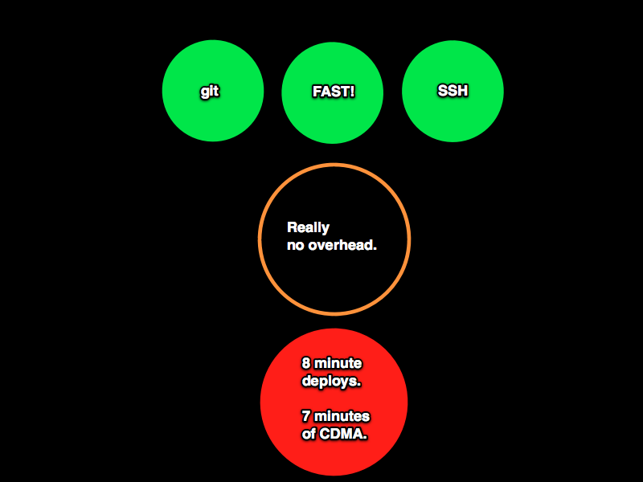
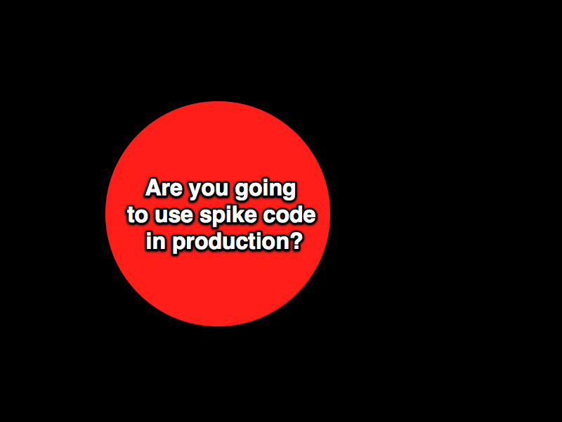
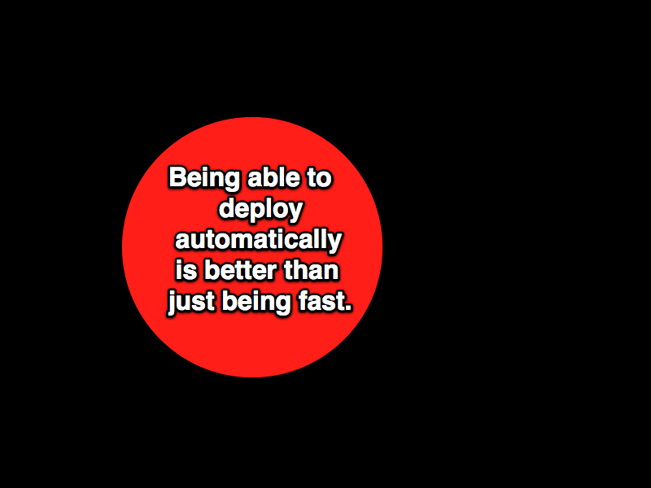

!SLIDE center full-page

# We start with a simple problem #

!SLIDE center full-page

!SLIDE center full-page

# OK.  And after dinner, maybe we have an actual business-related problem. #

!SLIDE center full-page

### (insert bash slide for 8-min / 7-min)###

!SLIDE center full-page

!SLIDE center full-page

# Which can be expressed as a series of constraints in our design context #

!SLIDE center full-page

!SLIDE center full-page

## And if I just try reading some vlad/cap code and doing a little spike on it ... ##

!SLIDE center full-page

!SLIDE center full-page

!SLIDE center full-page

# spike code #

!SLIDE center full-page

!SLIDE center full-page

!SLIDE center full-page

# initial BDD'd code #

!SLIDE center full-page

!SLIDE center full-page

!SLIDE center full-page

# Rake setup code #

!SLIDE center full-page

!SLIDE center full-page

!SLIDE center full-page

# config example code #

!SLIDE center full-page

!SLIDE center full-page

!SLIDE center full-page

# command-line examples, code, tests #

!SLIDE center full-page

!SLIDE center full-page

!SLIDE center full-page

# start big discussion about alexander's unselfconscious techniques #

!SLIDE center full-page

!SLIDE center full-page

# more big discussion about alexander's unselfconscious techniques #

!SLIDE center full-page

# some techniques are evolving from the craft, maybe selfconscious #

!SLIDE center full-page

!SLIDE center full-page

!SLIDE center full-page

!SLIDE center full-page

!SLIDE center full-page

## then low-level (kata) practices ##

#### then talk about how alexander used pattern language and nature of order to try to begin recovering unselfconscious techniques selfconsciously -- a jump-start to getting back to unselfconscious solutions ####

!SLIDE center full-page

!SLIDE center full-page

# git-flow sample #

!SLIDE center full-page

## (show config shazzle slides) ##

!SLIDE center full-page

!SLIDE center full-page

# config repo stuff #

!SLIDE center full-page

!SLIDE center full-page

!SLIDE center full-page

# continuous deployments, local deployments #

!SLIDE center full-page

!SLIDE center full-page

!SLIDE center full-page

# role support, config examples, wd roles #

!SLIDE center full-page

!SLIDE center full-page

!SLIDE center full-page

# simple open-uri changes, my example github deploy file(s) #

!SLIDE center full-page

!SLIDE center full-page

!SLIDE center full-page

# the simple UI, the complexity of the implementation #

!SLIDE center full-page

# there are a lot of outstanding problems #

!SLIDE center full-page

!SLIDE center full-page

# the implementation will introduce more features (constraints) and more overhead #

!SLIDE center full-page

!SLIDE center full-page

# show config refactoring to speed iteration time #

!SLIDE center full-page

# some problems remain outside the scope of our problem context #

!SLIDE center full-page

!SLIDE center full-page

