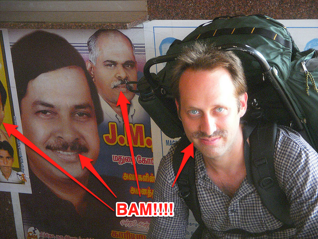
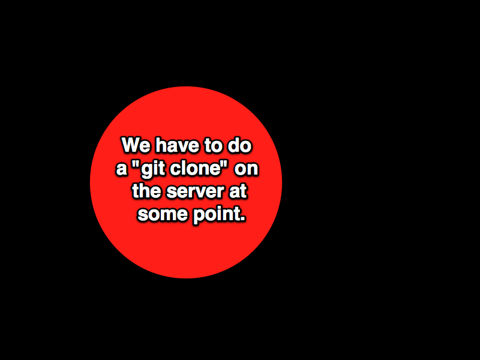
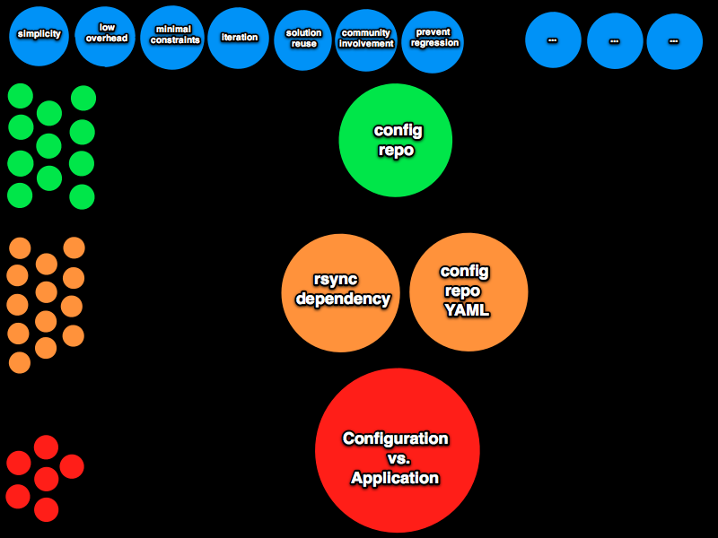

!SLIDE center 

## While travelling in India, I encountered a problem. ##

!SLIDE center

### How do I get one of those fly-ass Tamil Nadu 'staches? ###

!SLIDE center 

## OK.  And after a fashion intervention... ##

!SLIDE center 

## OK.  And after a fashion intervention, I encountered an actual business-related problem. ##

!SLIDE commandline incremental

    $ time rake vlad:deploy to=staging
    [ ... churn churn churn ... ]
    real	8m32.012s

    $ man how_long_until_my_shitty_cdma_connection_fails
    [ ... churn churn churn ... ]
    Between 6 and 7 minutes, on this train."

    $ asdfgjkagg90g4#%$@gskd    
    -bash: asdfgjkagg90g4#%gskd: command not found

!SLIDE center 

!SLIDE center 

# From Alexander, this problem is a Design question. #

!SLIDE center 

# Which can be expressed as a series of constraints in a design context. #

!SLIDE center 

### Like this. ###

!SLIDE center 

### Implicit in the context are constraints about whether it's worth pursuing the problem at all. ###
###  If the design process has low enough overhead it might be worth pursuing. ###

!SLIDE center 

### If I try reading some vlad or capistrano code and doing a little spike on whether I can make a fast deployment *somehow*, is there really any downside to the experiment? ###

!SLIDE center 

!SLIDE center 

!SLIDE code sm

    @@@ ruby

    # clone configuration repo, if it doesn't exist already; don't fail if it exists
    remote_task :pull_config_repository, :roles => :app do
      run "echo 'cloning repo: #{config_repository}'; cd #{parent_path(deploy_config_to)} && git clone #{config_repository} project_config || /bin/true"
    end
    
    # make sure the repo checkout is up-to-date
    remote_task :refresh_deployment, :roles => :app do
      run "echo 'Updating checkout in [#{deploy_to}]...' && " +
        "cd #{deploy_to} && git fetch origin +refs/heads/#{branch}:refs/remotes/origin/#{branch} && git reset --hard origin/#{branch}"
    end
    
    # update configuration files, overlay onto repo checkout
    desc "refresh remote configuration files"
    remote_task :refresh_config_files, :roles => :app do
      run "echo 'refreshing configuration files to [#{deploy_to}] from [#{deploy_config_to}/#{environment_name}]...' && " +
        "cd #{deploy_config_to} && git fetch origin && git reset --hard origin/master && " +
        "rsync -avz --progress #{deploy_config_to}/#{project_name}/#{environment_name}/ #{deploy_to}/"
    end
    
    desc "run any post-setup tasks for this environment"
    task :post_setup do
      if Rake::Task.task_defined? "deploy:#{environment_name}:post_setup"
        puts "Running deploy:#{environment_name}:post_setup task..."
        Rake::Task["deploy:#{environment_name}:post_setup"].invoke
      else
        puts "No task deploy:#{environment_name}:post_setup defined.  Skipping."
      end
    end

!SLIDE code sm

    @@@ ruby
    
    def per_environment_file
      build_filename("deploy-#{initial_environment_name}")
    end
    
    def load_global_configuration
      YAML.load(File.read(configuration_file))
    rescue Exception => e
      raise "Cannot load configuration file [#{configuration_file}]: #{e.to_s}"
    end  
    
    def load_environment_configuration
      return {} unless File.exists?(per_environment_file)
      puts "Overriding global configuration with environment [#{initial_environment_name}] settings from [#{per_environment_file}]"
      YAML.load(File.read(per_environment_file)) if File.exists?(per_environment_file)
    rescue Exception => e
      raise "Cannot load per-environment configuration file [#{per_environment_file}]: #{e.to_s}"
    end  
    
    def loaded_configuration 
      @loaded_configuration ||= load_global_configuration.merge(load_environment_configuration)
    end

!SLIDE center 

!SLIDE center 

!SLIDE center 

# initial BDD'd code #

!SLIDE center 

!SLIDE center 

!SLIDE center 

# Rake setup code #

!SLIDE center 

!SLIDE center 

!SLIDE center 

# config example code #

!SLIDE center 

!SLIDE center 

!SLIDE center 

# command-line examples, code, tests #

!SLIDE center 

!SLIDE center 

!SLIDE center 

# start big discussion about alexander's unselfconscious techniques #

!SLIDE center 

!SLIDE center 

# more big discussion about alexander's unselfconscious techniques #

!SLIDE center 

# some techniques are evolving from the craft, maybe selfconscious #

!SLIDE center 

!SLIDE center 

!SLIDE center 

!SLIDE center 

!SLIDE center 

## then low-level (kata) practices ##

#### then talk about how alexander used pattern language and nature of order to try to begin recovering unselfconscious techniques selfconsciously -- a jump-start to getting back to unselfconscious solutions ####

!SLIDE center 

!SLIDE center 

# git-flow sample #

!SLIDE center 

## (show config shazzle slides) ##

!SLIDE center 

!SLIDE center 

# config repo stuff #

!SLIDE center 

!SLIDE center 

!SLIDE center 

# continuous deployments, local deployments #

!SLIDE center 

!SLIDE center 

!SLIDE center 

# role support, config examples, wd roles #

!SLIDE center 

!SLIDE center 

!SLIDE center 

# simple open-uri changes, my example github deploy file(s) #

!SLIDE center 

!SLIDE center 

!SLIDE center 

# the simple UI, the complexity of the implementation #

!SLIDE center 

# there are a lot of outstanding problems #

!SLIDE center 

!SLIDE center 

# the implementation will introduce more features (constraints) and more overhead #

!SLIDE center 

!SLIDE center 

# show config refactoring to speed iteration time #

!SLIDE center 

# some problems remain outside the scope of our problem context #

!SLIDE center 

!SLIDE center 

