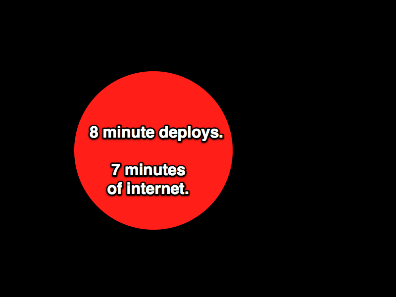

!SLIDE center full-page

!SLIDE center full-page

!SLIDE center full-page

!SLIDE center full-page

!SLIDE center full-page

# spike code #

!SLIDE center full-page

!SLIDE center full-page

# initial BDD'd code #

!SLIDE center full-page

!SLIDE center full-page

# Rake setup code #

!SLIDE center full-page

!SLIDE center full-page

# config example code #

!SLIDE center full-page

!SLIDE center full-page

!SLIDE center full-page

!SLIDE center full-page

!SLIDE center full-page

!SLIDE center full-page

!SLIDE center full-page

!SLIDE center full-page

!SLIDE center full-page

!SLIDE center full-page

!SLIDE center full-page

!SLIDE center full-page

!SLIDE center full-page

