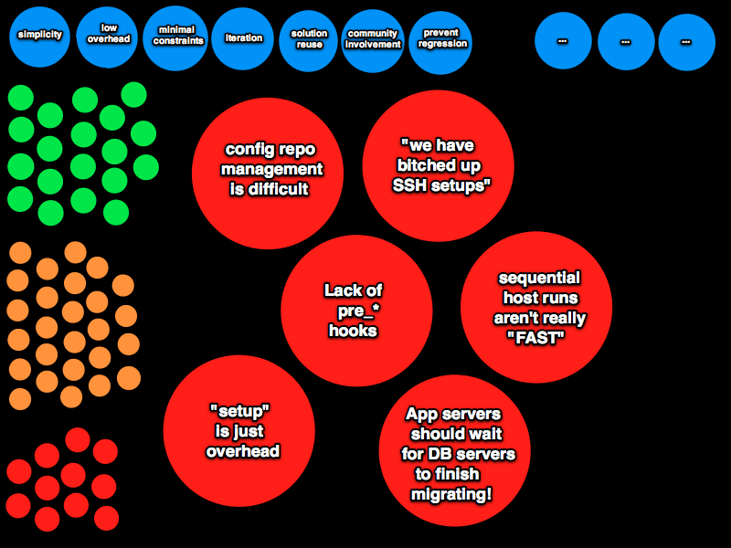

!SLIDE center 

## While travelling in India, I encountered a problem. ##

!SLIDE center

### How do I get one of those fly-ass Tamil Nadu 'staches? ###

!SLIDE center 

## OK.  And after a fashion intervention... ##

!SLIDE center 

## OK.  And after a fashion intervention, I encountered an actual business-related problem. ##

!SLIDE commandline incremental

    $ time rake vlad:deploy to=staging
    [ ... churn churn churn ... ]
    real	8m32.012s

    $ man how_long_until_my_shitty_cdma_connection_fails
    [ ... churn churn churn ... ]
    Between 6 and 7 minutes, on this train."

    $ asdfgjkagg90g4#%$@gskd    
    -bash: asdfgjkagg90g4#%gskd: command not found

!SLIDE center 

!SLIDE center 

# From Alexander, this problem is a Design question. #

!SLIDE center 

# Which can be expressed as a series of constraints in a design context. #

!SLIDE center 

### Like this. ###

!SLIDE center 

### Implicit in the context are constraints about whether it's worth pursuing the problem at all. ###
###  If the design process has low enough overhead it might be worth pursuing. ###

!SLIDE center 

### If I try reading some vlad or capistrano code and doing a little spike on whether I can make a fast deployment *somehow*, is there really any downside to the experiment? ###

!SLIDE center 

!SLIDE center 

!SLIDE code sm

    @@@ ruby

    # clone configuration repo, if it doesn't exist already; don't fail if it exists
    remote_task :pull_config_repository, :roles => :app do
      run "echo 'cloning repo: #{config_repository}'; cd #{parent_path(deploy_config_to)} && git clone #{config_repository} project_config || /bin/true"
    end
    
    # make sure the repo checkout is up-to-date
    remote_task :refresh_deployment, :roles => :app do
      run "echo 'Updating checkout in [#{deploy_to}]...' && " +
        "cd #{deploy_to} && git fetch origin +refs/heads/#{branch}:refs/remotes/origin/#{branch} && git reset --hard origin/#{branch}"
    end
    
    # update configuration files, overlay onto repo checkout
    desc "refresh remote configuration files"
    remote_task :refresh_config_files, :roles => :app do
      run "echo 'refreshing configuration files to [#{deploy_to}] from [#{deploy_config_to}/#{environment_name}]...' && " +
        "cd #{deploy_config_to} && git fetch origin && git reset --hard origin/master && " +
        "rsync -avz --progress #{deploy_config_to}/#{project_name}/#{environment_name}/ #{deploy_to}/"
    end
    
    desc "run any post-setup tasks for this environment"
    task :post_setup do
      if Rake::Task.task_defined? "deploy:#{environment_name}:post_setup"
        puts "Running deploy:#{environment_name}:post_setup task..."
        Rake::Task["deploy:#{environment_name}:post_setup"].invoke
      else
        puts "No task deploy:#{environment_name}:post_setup defined.  Skipping."
      end
    end

!SLIDE code sm

    @@@ ruby
    
    def per_environment_file
      build_filename("deploy-#{initial_environment_name}")
    end
    
    def load_global_configuration
      YAML.load(File.read(configuration_file))
    rescue Exception => e
      raise "Cannot load configuration file [#{configuration_file}]: #{e.to_s}"
    end  
    
    def load_environment_configuration
      return {} unless File.exists?(per_environment_file)
      puts "Overriding global configuration with environment [#{initial_environment_name}] settings from [#{per_environment_file}]"
      YAML.load(File.read(per_environment_file)) if File.exists?(per_environment_file)
    rescue Exception => e
      raise "Cannot load per-environment configuration file [#{per_environment_file}]: #{e.to_s}"
    end  
    
    def loaded_configuration 
      @loaded_configuration ||= load_global_configuration.merge(load_environment_configuration)
    end

!SLIDE center 

!SLIDE center 

!SLIDE center 

!SLIDE center 

!SLIDE center 

!SLIDE code sm

    @@@ ruby
    namespace :deploy do
      desc "Perform initial setup for deployment"
      task :setup do
        WhiskeyDisk.ensure_main_parent_path_is_present        if WhiskeyDisk.remote?
        WhiskeyDisk.ensure_config_parent_path_is_present     
        WhiskeyDisk.checkout_main_repository                  if WhiskeyDisk.remote?
        WhiskeyDisk.install_hooks                             if WhiskeyDisk.remote?
        WhiskeyDisk.checkout_configuration_repository
        WhiskeyDisk.update_main_repository_checkout           if WhiskeyDisk.remote?
        WhiskeyDisk.update_configuration_repository_checkout
        WhiskeyDisk.refresh_configuration
        WhiskeyDisk.run_post_setup_hooks
        WhiskeyDisk.flush
      end
      
      desc "Deploy now."
      task :now do
        WhiskeyDisk.update_main_repository_checkout           if WhiskeyDisk.remote?
        WhiskeyDisk.update_configuration_repository_checkout
        WhiskeyDisk.refresh_configuration
        WhiskeyDisk.run_post_deploy_hooks
        WhiskeyDisk.flush
      end
      
      task :post_setup do
        env = WhiskeyDisk[:environment]
        Rake::Task["deploy:#{env}:post_setup"].invoke if Rake::Task.task_defined? "deploy:#{env}:post_setup"      
      end
    
      task :post_deploy do
        env = WhiskeyDisk[:environment]
        Rake::Task["deploy:#{env}:post_deploy"].invoke if Rake::Task.task_defined? "deploy:#{env}:post_deploy"      
      end
    end

!SLIDE center 

!SLIDE center 

!SLIDE code smaller

    @@@ yml
    staging:
      domain: "user@www.example.com"
      deploy_to: "/var/www/suparsite.com/"
      repository: "git://github.com/clarkkent/suparsite.git"
      config_repository: "git@github.com:clarkkent/suparconfig.git"
      deploy_config_to: "/var/cache/git/suparconfig"
      branch: "production"
      rake_env:
        RAILS_ENV: "production"
    local:
      repository: "git://github.com/clarkkent/suparsite.git"
      config_repository: "git@github.com:clarkkent/suparconfig.git"
      deploy_to: "/Users/clark/git/suparsite"
      deploy_config_to: "/Users/clark/git/suparconfig"
      rake_env:
        RAILS_ENV: "production"

!SLIDE code sm

    @@@ ruby
    require 'rake'
    require 'rake/testtask'
    
    desc 'Default: run unit tests.'
    task :default => :test
    
    desc 'Test RubyCloud'
    Rake::TestTask.new(:test) do |t|
      t.libs << 'lib'
      t.pattern = 'spec/**/*_spec.rb'
      t.verbose = true
    end
    
    begin
      require 'jeweler'
      Jeweler::Tasks.new do |gemspec|
        gemspec.name = "whiskey_disk"
        gemspec.summary = "embarrassingly fast deployments."
        gemspec.description = "Opinionated gem for doing fast git-based server deployments."
        gemspec.email = "rick@rickbradley.com"
        gemspec.homepage = "http://github.com/flogic/whiskey_disk"
        gemspec.authors = ["Rick Bradley"]
        gemspec.add_dependency('rake')
      end
      Jeweler::GemcutterTasks.new  
    rescue LoadError
      puts "Jeweler not available. Install it with: sudo gem install jeweler -s http://gemcutter.org"
    end

!SLIDE center 

!SLIDE center 

!SLIDE code sm

    @@@ ruby
    def run_command
      eval File.read(File.join(File.dirname(__FILE__), *%w[.. bin wd]))
    end
    
    describe 'wd command' do
      before do
        ENV['to'] = ENV['path'] = nil
      end
    
      describe 'when no command-line arguments are specified' do
        before do
          Object.send(:remove_const, :ARGV)
          ARGV = []
        end  
    
        it 'should not run rake tasks' do
          Rake::Application.should.receive(:new).never
          lambda { run_command }
        end
    
        it 'should fail' do
          lambda { run_command }.should.raise
        end
      end
    
      describe "when the 'setup' command is specified" do
        before do
          Object.send(:remove_const, :ARGV)
          ARGV = ['setup']
        end  
    
        describe 'and no target is specified' do    
          it 'should not run rake tasks' do
            Rake::Application.should.receive(:new).never
            lambda { run_command }
          end
    
    # ... and so on

!SLIDE code sm

    @@@ ruby
    #!/usr/bin/env ruby 

    require 'optparse'
    require 'whiskey_disk/rake'

    $0 = "#{$0} setup|deploy"  # jesus, this is a hack.

    options = {}
    op = OptionParser.new do |opts|
      opts.on('-t=TARGET', '--to=TARGET', "deployment target") do |target| 
        options[:target] = target
      end

      opts.on('-p=TARGET', '--path=TARGET', "configuration path") do |path|
        options[:path] = path
      end

      opts.on_tail('-h', '--help', 'show this message') do
        raise opts.to_s
      end
    end

    rest = op.parse(ARGV)
    raise op.to_s unless options[:target]
    raise op.to_s unless rest and rest.size == 1
    command = rest.first
    raise op.to_s unless ['deploy', 'setup'].include?(command)

    ENV['to'] = options[:target]
    ENV['path'] = options[:path]

    if command == 'deploy'
      Rake::Task['deploy:now'].invoke
    else
      Rake::Task['deploy:setup'].invoke
    end

!SLIDE center 

!SLIDE center 

!SLIDE center 

# start big discussion about alexander's unselfconscious techniques #

!SLIDE center 

!SLIDE center 

# more big discussion about alexander's unselfconscious techniques #

!SLIDE center 

# some techniques are evolving from the craft, maybe selfconscious #

!SLIDE center 

!SLIDE center 

!SLIDE center 

!SLIDE center 

!SLIDE center 

## then low-level (kata) practices ##

#### then talk about how alexander used pattern language and nature of order to try to begin recovering unselfconscious techniques selfconsciously -- a jump-start to getting back to unselfconscious solutions ####

!SLIDE center 

!SLIDE center

!SLIDE center 

!SLIDE center 

!SLIDE code smaller

    @@@ yml
    foo:
      production:
        domain: "prod.foocorp.com"
        deploy_to: "/var/www/foo"
        repository: "git@github.com:foo/foo.git"
        branch: "stable"
        deploy_config_to: "/var/www/foo-config"
        config_repository: "git@github.com:foo/production-wd-config.git"
        config_branch: "master"
        rake_env:
          RAILS_ENV: 'production'
      demo:
        domain: "demo.foocorp.com"
        deploy_to: "/var/www/foo"
        repository: "git@github.com:foo/foo.git"
        branch: "stable"
        deploy_config_to: "/var/www/foo-config"
        config_repository: "git@github.com:foo/wd-config.git"
        config_branch: "master"
        config_target: "staging"
        rake_env:
          RAILS_ENV: 'demo'

!SLIDE center

!SLIDE center 

!SLIDE center 

!SLIDE center

### Run git-daemon locally on two bare git repositories (project + config). ###
### Track the bare git repos inside the main wd project repo. ###
### Really run wd, which ssh's to a testing user on a localhost alias. ###

!SLIDE code sm 

    @@@ ruby
    integration_spec do  
      describe 'when configured for a local deployment' do
        before do
          setup_deployment_area
        end
        
        describe 'when the configuration specifies no domain' do
          before do
            @config = scenario_config('local/deploy.yml')
            @args = "--path=#{@config} --to=project:local-default"
          end
    
          describe 'performing a setup' do
            it 'should perform a checkout of the repository to the target path' do
              run_setup(@args)
              File.exists?(deployed_file('project/README')).should == true
            end
                
            it 'should report the local setup as successful' do
              run_setup(@args)
              File.read(integration_log).should =~ /local => succeeded/
            end
    
            it 'should exit with a true status' do
              run_setup(@args).should == true
            end
          end
    # ... and so on

!SLIDE code sm

    @@@ ruby
    # local target directory, integration spec workspace
    def deployment_root
      '/tmp/wd-integration-target/destination/'
    end
    
    # allow defining an integration spec block
    def integration_spec(&block)
      yield if ENV['INTEGRATION'] and ENV['INTEGRATION'] != ''
    end
    
    # reset the deployment directory for integration specs
    def setup_deployment_area
      FileUtils.rm_rf(deployment_root)
      File.umask(0)
      Dir.mkdir(deployment_root, 0777)
      Dir.mkdir(deployed_file('log'), 0777)
    end
    
    # run a wd setup using the provided arguments string
    def run_setup(arguments)
      wd_path  = File.join(File.dirname(__FILE__), '..', 'bin', 'wd')
      lib_path = File.join(File.dirname(__FILE__), '..', 'lib')
      system("/usr/bin/env ruby -I #{lib_path} -r whiskey_disk -rubygems #{wd_path} setup \
        #{arguments} > #{integration_log} 2> #{integration_log}")
    end
    
    def integration_log
      deployed_file('log/out.txt')
    end
    
    # ... etc.

!SLIDE center 

!SLIDE center 

!SLIDE code smaller

    @@@ yml
    production:
      domain:
      - name: "tommy@app1.foocorp.com"
      - roles:
        - "app"
        - "www"
      - name: "tommy@jesusbox.foocorp.com"
        roles: 
        - "db"

!SLIDE code sm

    @@@ ruby
    namespace :deploy do
      task :create_rails_directories do
        if role? :www
          puts "creating log/ and tmp/ directories"
          Dir.chdir(RAILS_ROOT)
          system("mkdir -p log tmp")
        end
      end        
    
      task :db_migrate_if_necessary do
        Rake::Task['db:migrate'] if role? :db
      end
    
      # whytf is this even necessary?  Come on.  This should be built into ts:restart.
      task :thinking_sphinx_restart => [:environment] do
        if role? :app
          Rake::Task['ts:stop'].invoke rescue nil
          Rake::Task['ts:index'].invoke
          Rake::Task['ts:start'].invoke
        end
      end
    
      task :bounce_passenger do
        if role? :www
          puts "restarting Passenger web server"
          Dir.chdir(RAILS_ROOT)
          system("touch tmp/restart.txt")    
        end
      end
    
      # etc...
    
      task :post_setup  => [ :create_rails_directories ]
      task :post_deploy => [ :db_migrate_if_necessary, :thinking_sphinx_restart, :bounce_passenger ]
    end

!SLIDE center 

!SLIDE center 

!SLIDE code smaller 

    @@@ diff
    --- a/lib/whiskey_disk/config.rb
    +++ b/lib/whiskey_disk/config.rb
    @@ -1,4 +1,6 @@
     require 'yaml'
    +require 'uri'
    +require 'open-uri'

		# ... heh. :-)
     
    
!SLIDE center 

!SLIDE center 

!SLIDE code sm

    @@@ ruby
    require 'whiskey_disk/helpers'
    
    namespace :deploy do
    
      task :run_migrations do
        if role?(:db) and changed?('db/migrate')
          puts "Running database migrations..."
          Rake::Task['db:migrate'].invoke
        end
      end
    
      task :compress_assets do
        if changed?('public/stylesheets') or changed?('public/javascripts') 
          puts "Getting my asset munge on..."
          # do some expensive asset compression stuff
        end
      end
    
      task :post_deploy => [ :run_migrations, :compress_assets ]
    end

!SLIDE commandline incremental

    $ git diff ad71bc6..d5163e9 | wc -l
    
    1029

!SLIDE center 

## With increased users come revelations ##
## about new problems. ##

!SLIDE center 

!SLIDE center 

## These imply knowledge of more possible constraints in the design context. ##
## Improving the fit of our form will introduce more overhead. ##

!SLIDE center 

!SLIDE center 

# show config refactoring to speed iteration time #

!SLIDE center 

## We may decide that some constraints carry unacceptable overhead. ##

!SLIDE center 

!SLIDE center 

!SLIDE center

### show LoC footprint ###

!SLIDE center

### show speed ###
